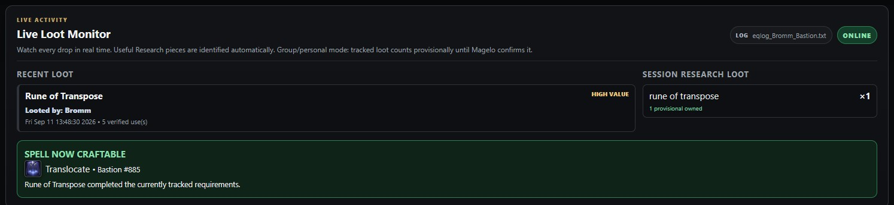
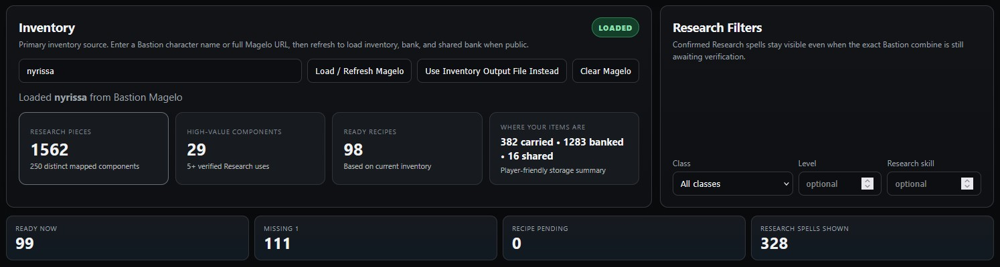
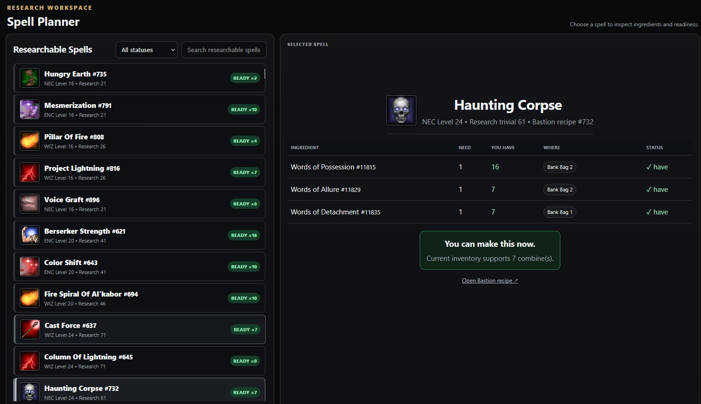
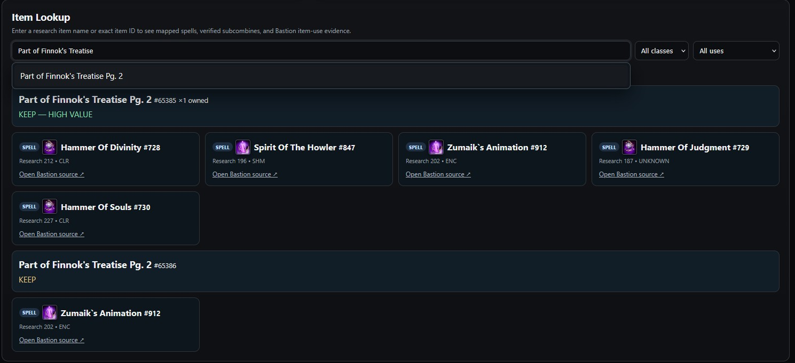
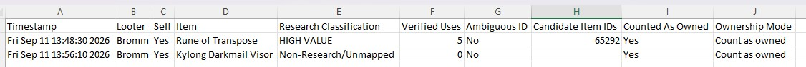
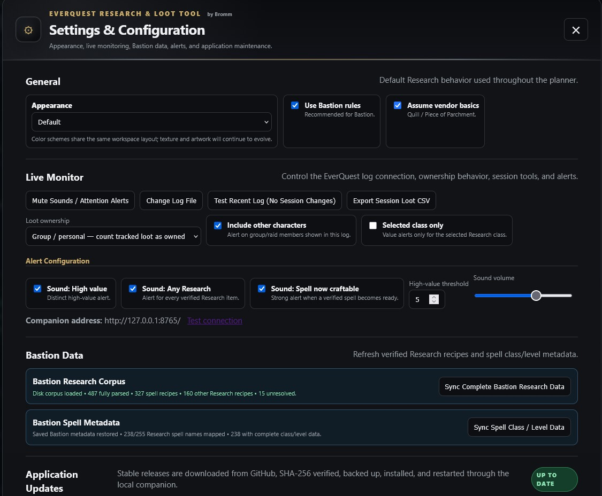

# EverQuest Research & Loot Tool by Bromm

A local Windows companion for the **Bastion EverQuest server** that combines live loot monitoring, spell Research planning, Bastion Magelo inventory mapping, item lookup, session tracking, and safe self-updating.

**Current stable release: v0.16.7-demo.1**

> Built for EverQuest players who want to know, in real time, whether a drop matters for Research — and whether they already have what they need to make a spell.

---

## Download

**Latest stable release:**  
https://github.com/jmdeland/eq-spell-research-assistant/releases/latest

**Repository:**  
https://github.com/jmdeland/eq-spell-research-assistant

Download the ZIP from the latest GitHub Release, extract it to a permanent folder, run the desktop shortcut installer once, and launch the tool from the desktop icon.

---

## What the tool does

The EverQuest Research & Loot Tool is designed around a simple question:

> **“What did we just loot, and does it matter?”**

It watches your EverQuest log in real time, identifies loot as it appears, checks that item against verified Bastion Research recipes, and shows whether the item is useful, how many Research uses it has, and whether it completes anything you can make.

It also combines that live information with Bastion Magelo inventory data so the tool can tell you what you already own, where it is stored, what ingredients are missing, and which Research spells are ready to craft.

Everything runs locally on your Windows PC.

---

# Major Features

## Live Loot Monitor

Live Loot is the primary workspace.

The monitor watches the selected EverQuest log file and displays loot as it happens, including:

- item name
- looter name
- timestamp
- Research classification
- number of verified Research uses
- ambiguous item-ID warnings when multiple items share the same visible name
- ordinary non-Research loot for full session visibility

Loot is classified into player-friendly categories such as:

- **HIGH VALUE**
- **KEEP**
- **UNKNOWN**
- **OTHER**

Research-looking items that are not yet mapped are treated as **coverage gaps**, not automatically dismissed as junk.

### Long-session performance

Live Loot is optimized for long and busy sessions:

- session writes are batched instead of saving one HTTP request per drop
- Live Loot UI redraws are batched
- ordinary/unmapped loot does not trigger unnecessary full recipe recalculation
- Recent Loot uses a bounded scrolling pane
- Session Loot uses a matching bounded scrolling pane

This keeps the page responsive instead of growing indefinitely during long groups or raids.

---

## Session Loot Tracking

The tool keeps a complete session history separate from the short Recent Loot display.

Session tracking includes:

- all tracked loot for the current session
- quantities by item
- provisional ownership counts
- recovery after a crash, reboot, update, or accidental close
- **Restore Session**
- **Start New Session**
- **End Current Loot Session**
- CSV export

Session state is stored outside the application folder so an application update does not wipe the active loot session.

Ending or starting a new session clears both the saved recovery data and the monitor's in-memory event buffer, preventing old loot from being replayed into a fresh session.

---

## Group / Personal vs Raid / Observation Mode

Live Loot can operate in two ownership modes.

### Group / Personal

Tracked loot can count provisionally toward your inventory until a Bastion Magelo refresh confirms the exact item.

### Raid / Observation

Loot is tracked for awareness only and does not alter recipe-readiness calculations.

This makes the same monitor useful whether you are watching your own group or following loot across a raid.

---

## Bastion Magelo Inventory Mapping

Bastion Magelo is the preferred inventory source.

The tool reads Bastion's searchable Magelo inventory data and uses exact item IDs wherever possible.

It can identify:

- equipped items
- inventory
- inventory bags
- bank
- bank bags
- shared bank
- stack quantities

Ingredient views can therefore show not only **how many you have**, but also **where they are**.

Examples:

- Inventory Bag 3
- Bank Bag 2
- Shared Bank
- Live Loot
- Vendor

Exact IDs matter because EverQuest can contain different items that share the same visible name.

---

## Research Spell Planner

The Research workspace shows which spells are ready, nearly ready, or still missing ingredients.

For each recipe, the tool can display:

- spell name
- class
- spell level
- Research trivial
- Bastion recipe number
- ingredient requirements
- quantity needed
- quantity owned
- item location
- missing-count status
- number of combines currently possible

Typical readiness states include:

- **READY**
- **MISSING 1**
- **MISSING 2**
- **MISSING**

The current dataset covers Bastion Research through **level 70 / Omens of War**.

---

## Exact Bastion Recipe Data

The tool uses Bastion-specific Research recipe information rather than assuming standard live-server recipe data is always correct.

Bastion recipe IDs are treated as authoritative where available.

The application supports:

- built-in verified Bastion recipes
- Bastion Research data synchronization
- unresolved-recipe tracking
- evidence/coverage diagnostics
- safe handling of same-name items with different IDs

---

## Quick Loot Lookup

Use **Quick Loot Lookup** when you want an immediate answer for a specific item.

Search by:

- full item name
- partial item name
- exact item ID

The result shows verified Research uses and whether the item should be kept.

Partial-name autocomplete is supported throughout the app.

Keyboard controls:

- **Down / Up** — move through suggestions
- **Tab** — complete the highlighted suggestion
- **Enter** — select or run the current action
- **Esc** — close suggestions

---

## Item / Reverse Lookup

The reverse lookup answers the opposite question:

> **“What Research recipes use this item?”**

This is especially useful when deciding whether a component is valuable before vendoring or destroying it.

The lookup can show:

- spell recipes
- Research subcombines
- recipe IDs
- class/level information
- readiness
- Bastion source links

---

## Default EverQuest Spell Icons

Spell icons use the supplied ROF2/Bastion client data rather than guessed modern icons.

The mapping is based on:

- `spells_us.txt`
- `new_icon`
- default client spell icon sheets

If an icon cannot be verified, the tool uses a neutral fallback instead of inventing one.

---

## Alerts and Sounds

Live Loot can provide audio feedback for important events.

Available alert concepts include:

- high-value Research drop
- Research-related drop
- newly craftable spell

Sounds can be adjusted or disabled in Settings.

---

## Themes and Appearance

The application includes multiple selectable appearances:

- **Default**
- **EQBlue**
- **EQGold**
- **EQRed**

The Default theme is the primary supported appearance, while the alternate themes provide different EverQuest-inspired color treatments.

---

## Application Updates

The tool includes a built-in GitHub updater.

The update flow:

1. checks the latest stable GitHub Release
2. downloads the release ZIP
3. verifies the SHA-256 digest
4. closes the running companion
5. backs up the current application folder
6. installs the replacement files
7. preserves `monitor-config.json`
8. refreshes the desktop shortcut
9. restarts the application
10. retains rollback backups

The desktop shortcut is also self-repaired on normal startup so it points at the active installation rather than an older extracted copy.

Starting with v0.16.5, the updater also remembers the target version and automatically changes the update status to **UPDATE COMPLETE** when the local companion returns on the new version.

Updating is optional. Older installed versions do not expire just because a newer release exists.

---

# Screenshots

## Live Loot Monitor

## Research Planning

## Ingredient and Inventory Mapping

## Item Lookup

## Settings

## Additional Workspace View

---

# Installation

## Recommended installation

1. Open the latest GitHub Release.
2. Download:
   `eq_spell_research_assistant_vX.X.X.zip`
3. Extract the entire ZIP to a **permanent folder**.
4. Do **not** run the application from inside the ZIP.
5. Run:
   `INSTALL-DESKTOP-SHORTCUT.ps1`
6. Launch **EverQuest Research & Loot Tool** from the desktop shortcut.
7. On first launch, choose the active EverQuest `eqlog_*.txt` file when prompted.
8. Leave the tray companion running while playing EverQuest.

The older batch launchers remain available for troubleshooting, but normal use should be through the desktop shortcut.

---

## Windows SmartScreen / Unknown Publisher

This is a hobby project and is not commercially code-signed.

Windows may display:

- **Unknown publisher**
- Microsoft Defender SmartScreen warnings

Only proceed when the files were downloaded from the official GitHub repository or release page.

The project does not require users to disable Windows security features.

---

# First-Time Setup

On first launch:

1. Select the active EverQuest log file.
2. Open Settings.
3. Confirm the Live Monitor is online.
4. Enter your Bastion character name or Magelo URL if you want inventory mapping.
5. Refresh Magelo.
6. Choose Group/Personal or Raid/Observation ownership behavior.
7. Adjust sound and appearance preferences if desired.

After that, normal use is simply launching the application before or during your EverQuest session.

---

# Data Accuracy

The tool intentionally favors **verified data over guessing**.

Important behavior:

- exact item IDs are preferred
- same-name item ambiguity is surfaced
- unmapped Research-looking drops are shown as UNKNOWN
- missing recipe coverage is treated as a data gap
- Bastion-specific recipe information is preferred over generic assumptions
- unverified spell icons are not guessed

This is especially important on an emulator server where server-specific data may differ from current live EverQuest.

---

# Privacy

The application runs locally on your Windows PC.

Local data can include:

- selected EverQuest log path
- application settings
- current session-recovery data
- cached Bastion Research data
- Bastion Magelo inventory information

The application contacts external services only for relevant functions such as:

- public Bastion pages / Magelo
- GitHub release checks and downloads

The tool does not require a cloud account.

---

# Development Channels

- **main** — stable production source
- **demo** — experimental/testing builds

Stable releases are published through GitHub Releases.

---

# What's New in v0.17.0

- Live zone tracking, including exact instanced-zone identity.
- Dedicated Observed Loot History workspace with permanent monthly archives.
- Archive-aware history search and optional recording toggle.
- Dedicated Live Event, persistence, and history-index workers to protect Live Loot responsiveness.
- Session reset, updater, Bastion sync, and spell-icon reliability improvements retained.

# Project

**EverQuest Research & Loot Tool by Bromm**

Repository:  
https://github.com/jmdeland/eq-spell-research-assistant

Latest stable release:  
https://github.com/jmdeland/eq-spell-research-assistant/releases/latest
